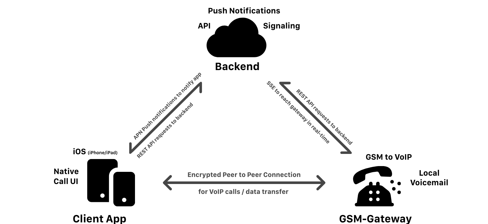

# P2P GSM-Telephone-Gateway with Client App
### Diploma thesis by [Lukas Kuster](https://github.com/lukaskuster) and [Quentin Wendegass](https://github.com/quentinwendegass) at HTL Mössingerstraße - 4th April 2019

## Table of contents
- [Abstract](#abstract)
  * [Assignment of Tasks](#assignment-of-tasks)
  * [Implementation](#implementation)
  * [Results](#results)
- [Links](#links)

## Abstract
People that are travelling in foreign countries and still want to be able to use their phone number from their home country, often have to expect huge roaming costs. Because of that, a user-friendly device equipped with the SIM card of the local carrier will be developed, that can then be placed locally in that country. This device will then be able to receive phone calls and SMS via the local carrier and transmit it through a direct Peer-to-peer connection over the internet to the end-user using a client app. Meanwhile the whole process should look and feel like a real, normal call.

### Assignment of Tasks
Because the data transfer rates that accumulate through the voice band streams are relatively big, the transfer has to happen directly between the gateway and the client, with only minimal interaction of a third party (server). The whole system should be designed as easy as possible, so that the setup consists only of starting up the device, quickly running through a setup in the client app and being able to use the gateway instantaneously.

### Implementation
The system basically consists of three components: the gateway, which establishes the calls and SMS messages through its GSM module and the client app, which enables the user to initiate/answer these calls and messages, as well as providing the option to change several settings. In addition, there is a Rendezvous- or Signaling-Server, which initiates the direct peer- to-peer connection between the client and the gateway, as well as the user management of the whole platform which provides the needed scalability.

### Results
The diploma thesis will show, whether such a product is technically as well as economically viable. While working on this project the whole software for such a product as well as a hard- ware prototype will be established.

## Links
* [iOS-Client: SIMplePhoneKit Documentation](https://lukaskuster.github.io/Diplomarbeit/code-docs/client-ios/) 

+ [Lukas' repo (@lukaskuster/Diplomarbeit)](https://github.com/lukaskuster/Diplomarbeit)
+ [Quentin's repo (@quentinwendegass/Diplomarbeit)](https://github.com/quentinwendegass/Diplomarbeit)
